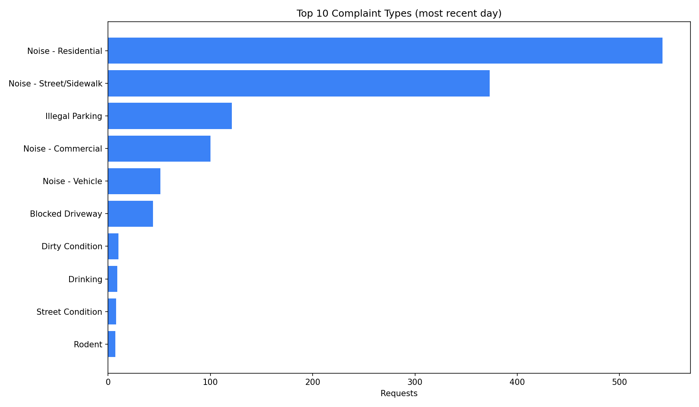
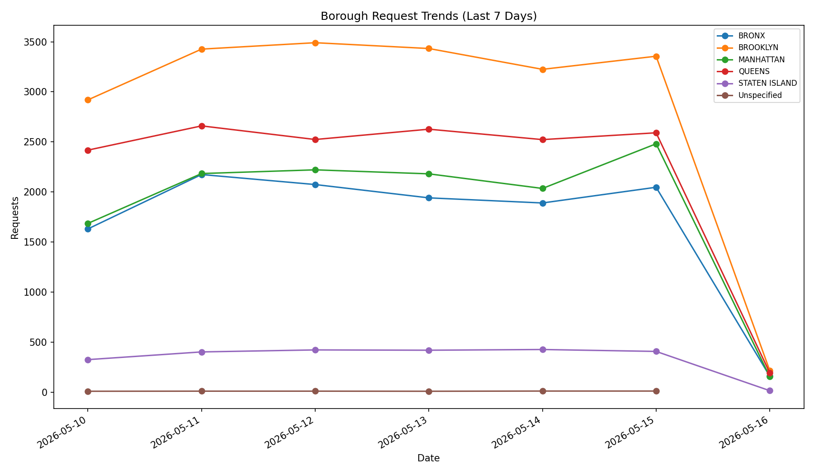
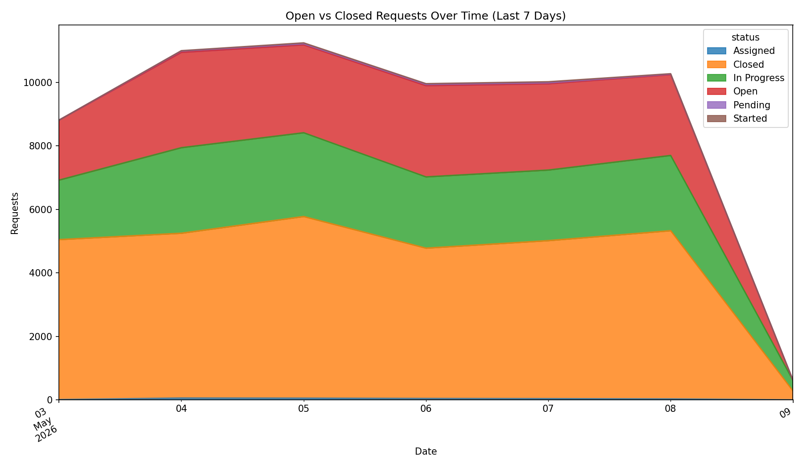
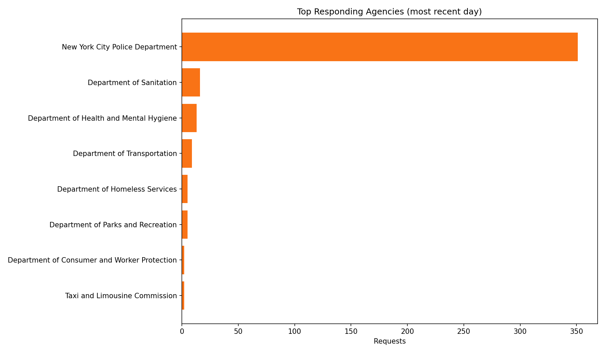

# NYC 311 Daily Data Quality & Reporting Pipeline

This project builds an automated data pipeline that ingests NYC 311 Service Requests from NYC OpenData, validates data quality, stores incremental records, and generates a daily operational summary report.

## What This Project Demonstrates

- API-based data ingestion using Python (`requests`)
- Incremental loading using `created_date` and `unique_key`
- Data quality validation with runtime checks + `pytest`
- SQLite-based storage and SQL analytics queries
- Automated daily markdown/HTML reporting with chart outputs
- GitHub Actions automation for scheduled daily runs

## Project Structure

```text
nyc-311-daily-data-quality-and-reporting-pipeline/
├── .github/workflows/daily_311_report.yml
├── data/
│   ├── raw/
│   └── processed/
├── docs/architecture.md
├── reports/
│   ├── charts/
│   ├── daily_summary.md
│   ├── daily_summary.html
│   └── latest_metrics.csv
├── sql/
│   ├── analytics_queries.sql
│   └── create_tables.sql
├── src/
│   ├── config.py
│   ├── extract_311.py
│   ├── generate_report.py
│   ├── load_311.py
│   ├── run_daily_pipeline.py
│   └── transform_311.py
├── tests/
└── requirements.txt
```

## Pipeline Flow

1. Read last successful timestamp from `data/processed/last_successful_load.txt`
2. Pull incremental rows from NYC OpenData API where `created_date > last_successful_loaded_timestamp`
3. Store raw JSON in `data/raw/311_requests_YYYY_MM_DD.json`
4. Clean and standardize records with pandas
5. Upsert into SQLite table `service_requests` using `unique_key`
6. Run data quality checks (nulls, duplicates, borough validity)
7. Generate report outputs in `reports/`
8. Save newest `created_date` as next incremental checkpoint

## Local Setup

```powershell
python -m venv .venv
.\.venv\Scripts\Activate.ps1
pip install -r requirements.txt
Copy-Item .env.example .env
```

Edit `.env` and set your tokens:

```dotenv
NYC311_API_ENDPOINT=https://data.cityofnewyork.us/api/v3/views/erm2-nwe9/query.json
NYC311_APP_TOKEN=your_app_token
NYC311_SECRET_TOKEN=your_secret_token
NYC311_PAGE_SIZE=50000
NYC311_MAX_PAGES=5
```

Optional API token for higher limits:

```powershell
$env:NYC311_APP_TOKEN="your_token_here"
```

## Run the Pipeline

```powershell
python -m src.run_daily_pipeline
```

## Run Tests

```powershell
pytest -q
```

## Daily Automation (GitHub Actions)

Workflow file: `.github/workflows/daily_311_report.yml`

Required repository secrets:

- `NYC311_APP_TOKEN`
- `NYC311_SECRET_TOKEN`

Schedule:

- `0 11 * * *` (daily at 11:00 UTC)

The workflow does:

1. Install dependencies
2. Run tests
3. Run the daily pipeline
4. Commit and push updated `data/` and `reports/` artifacts

## Example Outputs

- `reports/daily_summary.md`
- `reports/daily_summary.html`
- `reports/latest_metrics.csv`
- `reports/charts/top_complaints.html`

## Notes

- Primary API endpoint used in this project: `https://data.cityofnewyork.us/api/v3/views/erm2-nwe9/query.json`
- The pipeline uses SODA 3.0 query endpoint paging (`pageNumber`, `pageSize`) with POST queries.
- `NYC311_APP_TOKEN` is sent in both header and query params for compatibility with SODA3 examples.
- `NYC311_SECRET_TOKEN` is stored for environment parity and future auth changes.
- If you later migrate to PostgreSQL, keep the same extraction/transform layer and replace the SQLite load module.

<!-- PIPELINE-SUMMARY-START -->

## 📊 Latest Pipeline Run

**Run date:** 2026-05-06  
**Data quality status:** ❌ FAIL  

### Last 7 Days – Volume & Status

| request_date | total_requests | closed_requests | open_requests |
| --- | --- | --- | --- |
| 2026-05-04 | 355 | 112 | 243 |
| 2026-05-03 | 8816 | 5042 | 3774 |
| 2026-05-02 | 9577 | 6540 | 3037 |
| 2026-05-01 | 10514 | 6523 | 3991 |
| 2026-04-30 | 9992 | 6766 | 3226 |
| 2026-04-29 | 10012 | 7165 | 2847 |
| 2026-04-28 | 10065 | 7336 | 2729 |

### Charts

| Chart | Link |
| --- | --- |
| Top 10 Complaint Types | [view](reports/charts/top_complaints.html) |
| Borough Trends (7 days) | [view](reports/charts/borough_trends.html) |
| Open vs Closed Over Time | [view](reports/charts/open_vs_closed.html) |
| Top Agencies | [view](reports/charts/top_agencies.html) |

### Chart Screenshots

#### Top 10 Complaint Types
[Interactive chart](reports/charts/top_complaints.html)



#### Borough Trends (7 days)
[Interactive chart](reports/charts/borough_trends.html)



#### Open vs Closed Over Time
[Interactive chart](reports/charts/open_vs_closed.html)



#### Top Agencies
[Interactive chart](reports/charts/top_agencies.html)



_Charts are interactive HTML files with PNG screenshots saved for README preview._

<!-- PIPELINE-SUMMARY-END -->
